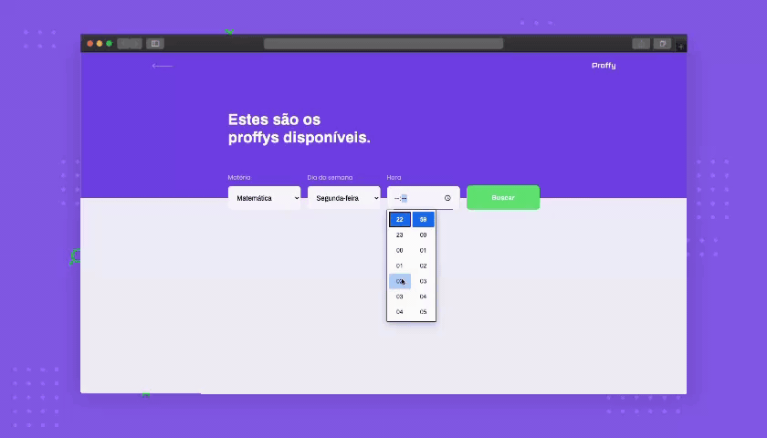

<!--Banner e logo-->


<!-- Badges -->
<p align="center">
  <a target="_blank" href="https://www.linkedin.com/in/pedro-soares-0a075916a/">
      
  </a>

  
  
  

  

  <a href="https://github.com/Preddo/proffy/commits/master">
    
  </a>

  
</p>

<!-- Index -->
<p align="center">
  <a href="#projeto">Projeto</a>&nbsp;&nbsp;&nbsp;|&nbsp;&nbsp;&nbsp;
  <a href="#demo-da-aplicação-web">Demo</a>&nbsp;&nbsp;&nbsp;|&nbsp;&nbsp;&nbsp;
  <a href="#tecnologias-aplicadas">Tecnologias</a>&nbsp;&nbsp;&nbsp;|&nbsp;&nbsp;&nbsp;
  <a href="#requerimentos">Requerimentos</a>&nbsp;&nbsp;&nbsp;|&nbsp;&nbsp;&nbsp;
  <a href="#como-executar">Como Executar</a>&nbsp;&nbsp;&nbsp;
</p>

<!-- Projeto -->
## Projeto
#### Objetivo
O Proffy surgiu com a missão de trazer uma homenagem aos educadores do Brasil, através de uma plataforma que conecta alunos e professores de diversas matérias, permitindo que os alunos encontrem professores e entrem em contato. Todo o desenvolvimento foi feito na semana do dia nacional dos profissionais de educação.

#### Funcionalidades
Proffy é uma aplicação inteiramente feita com typescript do back-end ao front-end ao app mobile.

###### Frontend Web
* Professores podem se cadastrar na plataforma através de um formulário no qual preenchem seus dados.
* Alunos podem buscar professores por meio de filtros de busca como matéria, dia da semana e horário.
* Alunos podem entrar em contato direto com o professor por whatsapp.
  
###### Frontend Mobile
* Alunos podem buscar professores por meio de filtros de busca como matéria, dia da semana e horário.
* Alunos podem entrar em contato direto com o professor por whatsapp.
* Alunos podem favoritar professores de sua preferência.

<!-- Demo da Aplicação Web -->
## Demo da Aplicação Web


<!-- Demo da Aplicação Mobile -->
## Demo da Aplicação Mobile


<!-- Tecnologias Aplicadas -->
## Tecnologias Aplicadas

#### Backend
O servidor foi construído em **Node.js** utilizando o **SQLite3** para administrar um banco de dados local e o **Knex** como Query Builder oficial. Para gerir as rotas foi utilizado o micro-framework **Express**.

#### Frontend Web
Para construir o frontend web foi utilizado a biblioteca **ReactJS** e o **axios** como cliente HTTP para consumir os dadosdo servidor.

#### Frontend Mobile
No projeto do aplicativo utilizei a ferramenta **expo** para criar meu projeto em **React Native**, novamente utilizando o **axios** como cliente HTTP para consumir os dados do servidor.

<!-- Requerimentos -->
## Requerimentos
Para conseguir rodar o projeto em sua máquina é necessário ter as seguintes ferramentas instaladas
- Node.js
- NPM ou Yarn
- Expo

<!-- Como Executar -->
## Como Executar

#### Clonando o projeto
```sh
# Clonando o projeto para a máquina
git clone https://github.com/Preddo/proffy.git
# Vai para a pasta do projeto proffy
cd proffy
```
#### Iniciando Backend
```sh
# Vai para a pasta server
cd server
# Instala as dependências
yarn
# Executa o servidor
yarn start
```
#### Iniciando Frontend Web
```sh
# Volta para a pasta proffy
cd ..
# Vai para a pasta web
cd web
# Instala as dependências do frontend web
yarn
# Executa o frontend web
yarn start
```
#### Iniciando Frontend Mobile
```sh
# Volta para a pasta proffy
cd ..
# Vai para a pasta mobile
cd mobile
# Instala as dependências do frontend mobile
yarn
# Executa o frontend mobile
yarn start
```
<!--License session-->
## 📝 Licença

Este projeto está sob a licença [MIT](./LICENSE).


